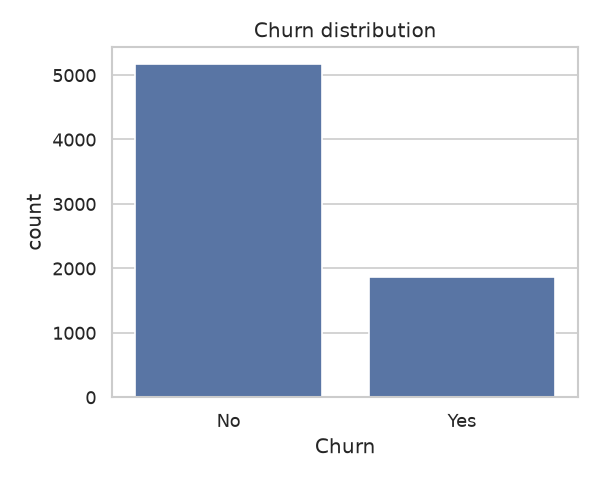
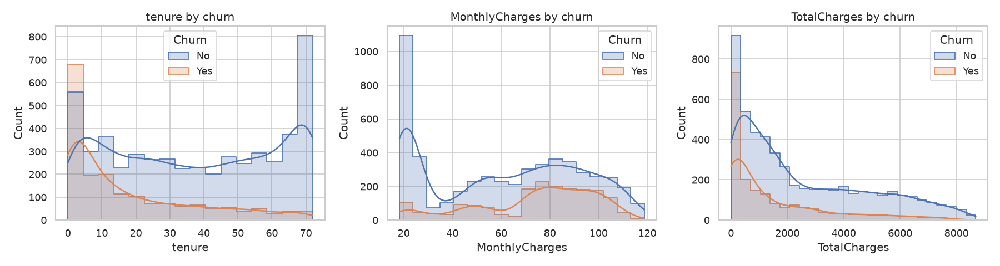
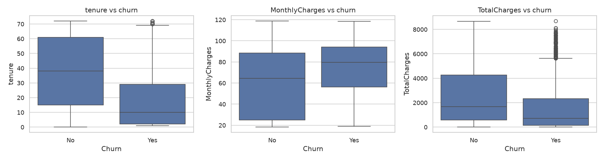
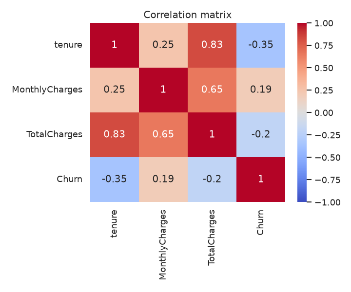

# Customer Churn Prediction – All Results

_Generated 2026-10-06 by `build_all_results.py` from the reports in `results/`. Do not edit by hand; rerun the script instead._

## Contents

- [1. Project Overview & Progress](#1-project-overview--progress)
- [2. Exploratory Data Analysis](#2-exploratory-data-analysis)
- [3. Feature Extraction & Scaling](#3-feature-extraction--scaling)
- [4. Model Results](#4-model-results)
- [5. Cost-Sensitive Analysis](#5-cost-sensitive-analysis)
- [6. Reproducing the Results](#6-reproducing-the-results)

## 1. Project Overview & Progress

### Customer Churn Prediction – Results & Progress

Telco customer churn prediction with **cost-sensitive decision thresholds** and (upcoming) **SHAP explanations**.
Every human-readable output of the project lives in this folder. Model binaries and prediction files stay in
`../artifacts/` because the scripts read them as inputs.

_Last updated: 2026-10-06_

#### Progress

| Stage | Status | Output |
|---|---|---|
| 1. Missing values + EDA | Done | [eda_report.txt](results/eda_report.txt), `plots/` |
| 2. Feature extraction + scaling | Done | [features_report.txt](results/features_report.txt) |
| 3. Imbalance-aware models (LogReg, MLP, XGBoost) | Done | [logistic_regression.md](results/logistic_regression.md), [mlp.md](results/mlp.md), [xgboost.md](results/xgboost.md) |
| 4. Cost-sensitive threshold selection | Done (placeholder costs) | [cost_comparison.md](results/cost_comparison.md), `cost_<model>.md` |
| 5. Real business costs (C_FN, C_FP) | **To do** | rerun stage 4 with real values |
| 6. SHAP analysis | **To do** | – |

#### 1. Data and missing values

- **Dataset:** 7,043 customers, 21 columns. The target `Churn` is 26.5% Yes, so the classes are imbalanced. No duplicate rows or customer IDs.
- **Missing values:** only 11 blank `TotalCharges`. All of them have `tenure = 0`, meaning these customers have not been billed yet, so the values are set to **0** rather than imputed.
- **Strongest churn signals:**

  | Signal | Churn rate |
  |---|---:|
  | Month-to-month contract | 42.7% |
  | Electronic check payment | 45.3% |
  | Fiber optic internet | 41.9% |
  | No online security / tech support | ~42% |
  | Senior citizens | 41.7% |

  Low tenure is also a strong signal: churners average 18 months, against 38 for customers who stay.


#### 2. Features

- **34 features:** 7 continuous and 27 binary.
- **Engineered features:**
  - AvgMonthlyCharge, ChargeIncrease
  - NumAddonServices, NumServices
  - IsAutoPayment, IsNewCustomer (tenure ≤ 6)
  - LivesAlone, FiberNoSupport
  - LogTotalCharges (replaces the skewed TotalCharges)
- **Cleanup:**
  - "No internet/phone service" is collapsed to "No".
  - Exact-duplicate flags were removed, because duplicates would split SHAP credit.
- **Split:** stratified **70/15/15** train/validation/test (4,929 / 1,057 / 1,057), `random_state=42`.
  - Scalers are fit on train only.
  - Validation is used for every tuning and threshold choice. Test is used only for final evaluation.
- **Three feature versions:**
  - `raw`: unscaled, used by XGBoost.
  - `std`: StandardScaler on the continuous features, used by LogReg and MLP.
  - `norm`: MinMax on all features.

#### 3. Models (test set, 280 churners of 1,057)

All three handle the class imbalance through weighting. Without weighting, the baselines reached only about 0.52 recall.

| Model | Imbalance handling | ROC-AUC | PR-AUC | Recall @0.50 | Missed churners @0.50 |
|---|---|---:|---:|---:|---:|
| Logistic Regression | `class_weight="balanced"` | **0.857** | **0.679** | 0.811 | 53 |
| MLP (32→16) | balanced sample weights | 0.854 | 0.656 | 0.818 | 51 |
| XGBoost (depth 3, 113 trees) | `scale_pos_weight=2.77` | 0.855 | 0.667 | **0.829** | **48** |

Accuracy is about 0.75 and is deliberately not optimized. A model that always predicts "no churn" scores 73.5% while catching no churners.

#### 4. Cost-sensitive thresholds

**Cost** = missed churners × **C_FN** + unneeded offers × **C_FP**.

The costs are currently **placeholders**:
- C_FN = 500: about 8 months × the average 65 monthly bill.
- C_FP = 100: one retention offer.

Each model's threshold minimizes validation cost and is then evaluated once on test.

| Model | Threshold | Val cost | Test cost | Missed churners | False alarms | Recall |
|---|---:|---:|---:|---:|---:|---:|
| **Logistic Regression** (selected) | 0.45 | **46,600** | 44,600 | 40 | 246 | 0.857 |
| MLP | 0.48 | 46,800 | **42,000** | 40 | 220 | 0.857 |
| XGBoost | 0.44 | 48,700 | 45,000 | 39 | 255 | 0.861 |
| _Contact nobody_ | – | – | 140,000 | 280 | 0 | 0 |
| _Contact everyone_ | – | – | 77,700 | 0 | 777 | 1.0 |

- **Logistic Regression is selected** because it has the lowest validation cost. Its test cost is **68% below doing nothing**.
- **The models are statistically tied.** In a paired bootstrap, every 95% CI for the cost difference between models includes 0.
- **The cost-optimal thresholds sit at about 0.45**, not at the textbook C_FP/(C_FP+C_FN) = 0.17. Class weighting inflates the predicted probabilities, which shifts the best threshold upward.
- **The cost curves are flat between about 0.2 and 0.5**, so the exact threshold matters little. The threshold moves sharply only once a missed churner costs **10× or more** than an offer.


#### Files in this folder

| File | Contents |
|---|---|
| `eda_report.txt` | Missing-value handling, summary statistics, churn rate by every category, correlations |
| `features_report.txt` | Feature list, split sizes, scaling checks |
| `logistic_regression.md`, `mlp.md`, `xgboost.md` | Per-model training and evaluation at 0.50 and at the F2-optimized threshold |
| `cost_logistic_regression.md`, `cost_mlp.md`, `cost_xgboost.md` | Per-model cost analysis and cost-ratio sensitivity |
| `cost_comparison.md` | Cross-model comparison, model selection and bootstrap significance |
| `plots/` | EDA charts and validation cost curves |

#### How to reproduce

```bash
./run_pipeline.sh                          # full pipeline with placeholder costs
./run_pipeline.sh --c-fn 800 --c-fp 50     # with real business costs
```

The pipeline uses the project virtual environment in `venv/`, with dependencies pinned in `requirements.txt`.

#### Next steps

1. Replace C_FN/C_FP with real business numbers and rerun.
2. SHAP analysis:
   - LinearExplainer for the selected Logistic Regression.
   - TreeExplainer for XGBoost, to compare against it.
   - Summary, dependence and per-customer waterfall plots.

## 2. Exploratory Data Analysis

### Plots

**Churn distribution (26.5% churn, imbalanced)**



**Tenure, MonthlyCharges and TotalCharges distributions by churn**



**Numeric features vs churn**



**Churn rate for every categorical feature**


**Correlation between numeric features and churn**



### Full EDA report (missing values, summary statistics, churn rate by category, correlations)

```text

======================================================================
RAW DATA
======================================================================
Shape: (7043, 21)
Duplicate rows: 0
Duplicate customerIDs: 0

======================================================================
MISSING VALUES (before)
======================================================================
TotalCharges    11

Rows with missing TotalCharges:
      customerID  tenure  MonthlyCharges  TotalCharges
488   4472-LVYGI       0           52.55           NaN
753   3115-CZMZD       0           20.25           NaN
936   5709-LVOEQ       0           80.85           NaN
1082  4367-NUYAO       0           25.75           NaN
1340  1371-DWPAZ       0           56.05           NaN
3331  7644-OMVMY       0           19.85           NaN
3826  3213-VVOLG       0           25.35           NaN
4380  2520-SGTTA       0           20.00           NaN
5218  2923-ARZLG       0           19.70           NaN
6670  4075-WKNIU       0           73.35           NaN
6754  2775-SEFEE       0           61.90           NaN

======================================================================
MISSING VALUES (after)
======================================================================
Total missing cells: 0

======================================================================
DTYPES
======================================================================
customerID              str
gender                  str
SeniorCitizen           str
Partner                 str
Dependents              str
tenure                int64
PhoneService            str
MultipleLines           str
InternetService         str
OnlineSecurity          str
OnlineBackup            str
DeviceProtection        str
TechSupport             str
StreamingTV             str
StreamingMovies         str
Contract                str
PaperlessBilling        str
PaymentMethod           str
MonthlyCharges      float64
TotalCharges        float64
Churn                   str

======================================================================
NUMERIC SUMMARY
======================================================================
        tenure  MonthlyCharges  TotalCharges
count  7043.00         7043.00       7043.00
mean     32.37           64.76       2279.73
std      24.56           30.09       2266.79
min       0.00           18.25          0.00
25%       9.00           35.50        398.55
50%      29.00           70.35       1394.55
75%      55.00           89.85       3786.60
max      72.00          118.75       8684.80

======================================================================
CHURN DISTRIBUTION
======================================================================
       count    pct
Churn              
No      5174  73.46
Yes     1869  26.54

======================================================================
CHURN RATE BY CATEGORY (%)
======================================================================

gender:
gender
Female    26.9
Male      26.2

SeniorCitizen:
SeniorCitizen
Yes    41.7
No     23.6

Partner:
Partner
No     33.0
Yes    19.7

Dependents:
Dependents
No     31.3
Yes    15.5

PhoneService:
PhoneService
Yes    26.7
No     24.9

MultipleLines:
MultipleLines
Yes                 28.6
No                  25.0
No phone service    24.9

InternetService:
InternetService
Fiber optic    41.9
DSL            19.0
No              7.4

OnlineSecurity:
OnlineSecurity
No                     41.8
Yes                    14.6
No internet service     7.4

OnlineBackup:
OnlineBackup
No                     39.9
Yes                    21.5
No internet service     7.4

DeviceProtection:
DeviceProtection
No                     39.1
Yes                    22.5
No internet service     7.4

TechSupport:
TechSupport
No                     41.6
Yes                    15.2
No internet service     7.4

StreamingTV:
StreamingTV
No                     33.5
Yes                    30.1
No internet service     7.4

StreamingMovies:
StreamingMovies
No                     33.7
Yes                    29.9
No internet service     7.4

Contract:
Contract
Month-to-month    42.7
One year          11.3
Two year           2.8

PaperlessBilling:
PaperlessBilling
Yes    33.6
No     16.3

PaymentMethod:
PaymentMethod
Electronic check             45.3
Mailed check                 19.1
Bank transfer (automatic)    16.7
Credit card (automatic)      15.2

======================================================================
NUMERIC MEANS BY CHURN
======================================================================
       tenure  MonthlyCharges  TotalCharges
Churn                                      
No      37.57           61.27       2549.91
Yes     17.98           74.44       1531.80

======================================================================
CORRELATION (numeric + churn flag)
======================================================================
                tenure  MonthlyCharges  TotalCharges  Churn
tenure           1.000           0.248         0.826 -0.352
MonthlyCharges   0.248           1.000         0.651  0.193
TotalCharges     0.826           0.651         1.000 -0.198
Churn           -0.352           0.193        -0.198  1.000

Plots saved to /home/atharv/Desktop/projects/majorProjectChurn/results/plots/
Cleaned data saved to /home/atharv/Desktop/projects/majorProjectChurn/data/data_clean.csv
```

## 3. Feature Extraction & Scaling

```text

======================================================================
FEATURES
======================================================================
34 features, 7 continuous, 27 binary
gender                                     int64
SeniorCitizen                              int64
Partner                                    int64
Dependents                                 int64
tenure                                     int64
PhoneService                               int64
MultipleLines                              int64
OnlineSecurity                             int64
OnlineBackup                               int64
DeviceProtection                           int64
TechSupport                                int64
StreamingTV                                int64
StreamingMovies                            int64
PaperlessBilling                           int64
MonthlyCharges                           float64
AvgMonthlyCharge                         float64
ChargeIncrease                           float64
NumAddonServices                           int64
NumServices                                int64
IsAutoPayment                              int64
IsNewCustomer                              int64
LivesAlone                                 int64
FiberNoSupport                             int64
LogTotalCharges                          float64
InternetService_DSL                        int64
InternetService_Fiber_optic                int64
InternetService_No                         int64
Contract_Month_to_month                    int64
Contract_One_year                          int64
Contract_Two_year                          int64
PaymentMethod_Bank_transfer_automatic      int64
PaymentMethod_Credit_card_automatic        int64
PaymentMethod_Electronic_check             int64
PaymentMethod_Mailed_check                 int64

======================================================================
SPLIT
======================================================================
Train: (4929, 34), churn rate 0.265
Val:   (1057, 34), churn rate 0.266
Test:  (1057, 34), churn rate 0.265

======================================================================
STANDARDIZED (train, continuous) - expect mean 0, std 1
======================================================================
                  mean  std
tenure            -0.0  1.0
MonthlyCharges    -0.0  1.0
LogTotalCharges    0.0  1.0
AvgMonthlyCharge   0.0  1.0
ChargeIncrease     0.0  1.0
NumAddonServices  -0.0  1.0
NumServices       -0.0  1.0

======================================================================
NORMALIZED (train) - expect range [0, 1]
======================================================================
                  min  max
tenure            0.0  1.0
MonthlyCharges    0.0  1.0
LogTotalCharges   0.0  1.0
AvgMonthlyCharge  0.0  1.0
ChargeIncrease    0.0  1.0
NumAddonServices  0.0  1.0
NumServices       0.0  1.0

Saved datasets to /home/atharv/Desktop/projects/majorProjectChurn/data/processed/ and scalers to /home/atharv/Desktop/projects/majorProjectChurn/artifacts/scalers.joblib
```

## 4. Model Results

### Logistic Regression – Cost-Sensitive Churn Prediction

All numbers below come from running `train_logistic_regression.py` (`venv/bin/python train_logistic_regression.py`).

#### Dataset

- Source: IBM Telco Customer Churn (`data/data.csv`), 7043 customers, 21 raw columns.
- Target: `Churn` (Yes/No), encoded as 1 = churn, 0 = no churn.
- Model input: `data/processed/X_{train,val,test}_std.csv` and `y_{train,val,test}.csv`, produced by `eda.py` and `features.py`; 34 features.
- Stratified 70/15/15 train/validation/test split, `random_state=42`: train 4929, validation 1057, test 1057 rows.
- The validation set is used for choosing the regularization strength and the decision threshold. The test set is used once, for final evaluation.

#### Class Distribution

| Split | Rows | No Churn (0) | Churn (1) |
|---|---:|---:|---:|
| Train | 4929 | 3621 (73.5%) | 1308 (26.5%) |
| Validation | 1057 | 776 (73.4%) | 281 (26.6%) |
| Test | 1057 | 777 (73.5%) | 280 (26.5%) |
| Total | 7043 | 5174 (73.5%) | 1869 (26.5%) |

#### Preprocessing

- **Missing values** (`eda.py`): the only missing values are 11 blank `TotalCharges` entries, all with `tenure = 0` (customers not yet billed), filled with 0.
- **Duplicates**: none in the data, so nothing was removed. `customerID` is dropped as an identifier.
- **Feature engineering** (`features.py`): "No internet service" / "No phone service" collapsed to "No"; engineered `AvgMonthlyCharge`, `ChargeIncrease`, `NumAddonServices`, `NumServices`, `IsAutoPayment`, `IsNewCustomer` (tenure <= 6), `LivesAlone`, `FiberNoSupport`, and `LogTotalCharges` (replaces `TotalCharges`).
- **Encoding**: binary Yes/No columns and gender mapped to 0/1; `InternetService`, `Contract` and `PaymentMethod` one-hot encoded. 34 features in total (7 continuous, 27 binary).
- **Scaling**: `StandardScaler` on the 7 continuous features (`tenure`, `MonthlyCharges`, `LogTotalCharges`, `AvgMonthlyCharge`, `ChargeIncrease`, `NumAddonServices`, `NumServices`), **fit on the training set only** and applied to validation/test. Binary flags are left as 0/1.
- No preprocessing step, hyperparameter or threshold uses test-set information.

#### Class Imbalance Handling

- **Original class distribution (train)**: 3621 non-churn (73.5%) vs 1308 churn (26.5%), about 2.77 non-churners per churner.
- **`class_weight="balanced"`**: each class is weighted by `n_samples / (n_classes * n_class_samples)`. On the training set this gives:
  - No Churn (0): 4929 / (2 x 3621) = **0.6806**
  - Churn (1): 4929 / (2 x 1308) = **1.8842**
  - A churner therefore counts **2.77x** as much as a non-churner in the log-loss, so both classes contribute equally in total.
- **Why it is necessary**: with ~73.5% / 26.5% classes, an unweighted model minimizes loss mostly on the majority class and pushes churn probabilities down. The earlier unweighted baseline caught only about half of the churners (recall 0.521). A false negative (a churner we do not contact) costs far more than a false positive (an unneeded retention offer), so the loss should not be dominated by the majority class. Weighting shifts the probabilities upward for churn-like customers; the threshold search then trades precision for recall explicitly.

#### Model

- `sklearn.linear_model.LogisticRegression(C=1.0, class_weight="balanced", solver="lbfgs", max_iter=5000, random_state=42)`
- **Regularization**: L2 (the scikit-learn default). `C` was chosen from [0.001, 0.01, 0.1, 1.0, 10.0, 100.0] by **validation PR-AUC** (threshold-independent; test not used):

| C | Val ROC-AUC | Val PR-AUC |
|---:|---:|---:|
| 0.001 | 0.8303 | 0.6297 |
| 0.01 | 0.8346 | 0.6362 |
| 0.1 | 0.8362 | 0.6415 |
| 1.0 (selected) | 0.8369 | 0.6447 |
| 10.0 | 0.8370 | 0.6441 |
| 100.0 | 0.8371 | 0.6447 |

- Train ROC-AUC 0.8546 vs test ROC-AUC 0.8573: little overfitting.
- Largest positive coefficients (raise churn odds): InternetService_Fiber_optic (+0.87), Contract_Month_to_month (+0.78), NumServices (+0.44), PaperlessBilling (+0.36), StreamingMovies (+0.22).
- Largest negative coefficients (lower churn odds): InternetService_No (-1.09), Contract_Two_year (-1.03), LogTotalCharges (-0.73), PhoneService (-0.43), TechSupport (-0.41).
- Saved to `artifacts/logistic_regression.joblib` (model, chosen threshold, C, feature names). Validation and test probabilities are in `artifacts/logistic_regression_probs.csv` (`split,y_true,proba`).

#### Baseline Evaluation

Threshold = 0.50, **test set**:

| Metric | Score |
|---|---:|
| Accuracy | 0.7455 |
| Precision | 0.5124 |
| Recall | 0.8107 |
| F1-score | 0.6279 |
| F2-score | 0.7262 |
| ROC-AUC | 0.8573 |
| PR-AUC | 0.6788 |
| False Positives | 216 |
| False Negatives | 53 |

Confusion matrix (test, threshold 0.50):

| | Predicted No Churn | Predicted Churn |
|---|---:|---:|
| **Actual No Churn** | 561 (TN) | 216 (FP) |
| **Actual Churn** | 53 (FN) | 227 (TP) |

Validation set at threshold 0.50: accuracy 0.7512, precision 0.5216, recall 0.7722, F1 0.6227, F2 0.7045, ROC-AUC 0.8369, PR-AUC 0.6447, FP 199, FN 64.

#### Threshold Optimization

- Probabilities were computed on the **validation set only**. Thresholds from 0.10 to 0.90 in steps of 0.01 (81 values) were evaluated.
- **Criterion**: maximize **F2-score** (beta = 2, recall weighted 4x as much as precision in the harmonic mean). This is the same rule used for the MLP and XGBoost models, so the three are comparable. F2 favors recall but still penalizes a collapse in precision, unlike maximizing recall alone (which would go to the lowest threshold).
- **Selected threshold: 0.45** (validation F2 = 0.7359, vs 0.7045 at 0.50).
- The test set was not looked at during this selection.

Validation sweep (selected rows):

| Threshold | Precision | Recall | F1 | F2 | FP | FN |
|---:|---:|---:|---:|---:|---:|---:|
| 0.20 | 0.3886 | 0.9253 | 0.5474 | 0.7250 | 409 | 21 |
| 0.25 | 0.4123 | 0.9039 | 0.5663 | 0.7299 | 362 | 27 |
| 0.30 | 0.4269 | 0.8826 | 0.5754 | 0.7273 | 333 | 33 |
| 0.35 | 0.4449 | 0.8612 | 0.5867 | 0.7254 | 302 | 39 |
| 0.40 | 0.4742 | 0.8505 | 0.6089 | 0.7340 | 265 | 42 |
| 0.45 (selected) | 0.5076 | 0.8292 | 0.6297 | 0.7359 | 226 | 48 |
| 0.50 | 0.5216 | 0.7722 | 0.6227 | 0.7045 | 199 | 64 |
| 0.60 | 0.5736 | 0.6797 | 0.6221 | 0.6555 | 142 | 90 |

Validation set at threshold 0.45: accuracy 0.7408, precision 0.5076, recall 0.8292, F1 0.6297, F2 0.7359, ROC-AUC 0.8369, PR-AUC 0.6447, FP 226, FN 48.

#### Final Evaluation

Threshold = 0.45, **test set** (single final evaluation):

| Metric | Score |
|---|---:|
| Accuracy | 0.7294 |
| Precision | 0.4938 |
| Recall | 0.8571 |
| F1-score | 0.6266 |
| F2-score | 0.7472 |
| ROC-AUC | 0.8573 |
| PR-AUC | 0.6788 |
| False Positives | 246 |
| False Negatives | 40 |

Confusion matrix (test, threshold 0.45):

| | Predicted No Churn | Predicted Churn |
|---|---:|---:|
| **Actual No Churn** | 531 (TN) | 246 (FP) |
| **Actual Churn** | 40 (FN) | 240 (TP) |

ROC-AUC and PR-AUC do not depend on the threshold, so they are the same as in the baseline.

#### False Negative Reduction

Test set (280 actual churners):

| | Threshold 0.50 | Optimized Threshold (0.45) |
|---|---:|---:|
| Recall | 0.8107 | 0.8571 |
| Precision | 0.5124 | 0.4938 |
| F1 | 0.6279 | 0.6266 |
| F2 | 0.7262 | 0.7472 |
| False Negatives | 53 | 40 |
| False Positives | 216 | 246 |

False negatives before threshold optimization:
53

False negatives after threshold optimization:
40

Reduction:
53 - 40 = **13** (24.5% fewer missed churners), at the cost of +30 false positives.

#### Observations

- **Churn detection**: class weighting alone already moves recall at 0.50 to 0.811 on test (the unweighted baseline in project memory had 0.521 on its earlier 80/20 split). With the F2 threshold, the model catches 240 of 280 test churners (recall 0.857).
- **False-negative reduction**: missed churners drop from 53 to 40 (13 fewer).
- **Precision/recall tradeoff**: precision moves from 0.512 to 0.494 and false positives from 216 to 246 (+30). Accuracy moves from 0.746 to 0.729; accuracy is not the target metric here. F1 goes from 0.628 to 0.627, while F2 goes from 0.726 to 0.747.
- **Ranking quality** is unchanged by the threshold: test ROC-AUC 0.857, PR-AUC 0.679 (churn base rate 0.265).
- **Is the optimized threshold useful?** Yes. When a missed churner costs much more than a retention offer, trading the extra false positives for fewer missed churners is worthwhile, and test F2 improves, which shows the validation-chosen threshold generalizes. The final operating point should come from the cost-sensitive stage (FN cost vs FP cost) using the saved validation probabilities.

### MLP – Cost-Sensitive Churn Prediction

All numbers below come from running `train_mlp.py` (scikit-learn 1.9.1).

#### Dataset

- IBM Telco Customer Churn: `data/data.csv`, with 7043 customers and 21 raw columns. The target is `Churn` (1 = churned).
- The model reads the prepared features in `data/processed/X_{train,val,test}_std.csv` and `y_{train,val,test}.csv`, which `eda.py` and `features.py` produce.
- There are 34 model features after feature engineering and encoding.

#### Class Distribution

| Split | Rows | Churn (1) | No churn (0) | Churn rate |
|---|---:|---:|---:|---:|
| Train | 4929 | 1308 | 3621 | 26.5% |
| Val | 1057 | 281 | 776 | 26.6% |
| Test | 1057 | 280 | 777 | 26.5% |
| **Total** | 7043 | 1869 | 5174 | 26.5% |

About 73.5% of customers stay and 26.5% churn. The split is stratified, so every split keeps the same ratio.

#### Preprocessing

- **Missing values:** `eda.py` filled the only 11 missing values, which are blank `TotalCharges` entries. All of them have `tenure = 0`, so they were set to 0 because these customers have not been billed yet.
- **Duplicates:** The data has no duplicate rows, so nothing was removed.
- **Feature engineering** (`features.py`): "No internet service" and "No phone service" are collapsed to "No". The new features are AvgMonthlyCharge, ChargeIncrease, NumAddonServices, NumServices, IsAutoPayment, IsNewCustomer (tenure <= 6), LivesAlone, FiberNoSupport and LogTotalCharges, which replaces TotalCharges. `customerID` is dropped.
- **Encoding:** Binary Yes/No and gender columns become 0/1. InternetService, Contract and PaymentMethod are one-hot encoded. The result is 34 features.
- **Split:** A stratified 70/15/15 train/validation/test split with `random_state=42` gives 4929/1057/1057 rows.
- **Scaling:** A StandardScaler is applied to the 7 continuous features (tenure, MonthlyCharges, LogTotalCharges, AvgMonthlyCharge, ChargeIncrease, NumAddonServices, NumServices). It is **fit on the training set only** and then applied to the validation and test sets. Binary flags stay 0/1.

#### Class Imbalance Handling

- **Method used: Option A, balanced sample weights.** `inspect.signature(MLPClassifier.fit)` in the installed scikit-learn 1.9.1 is `(self, X, y, sample_weight=None)`, so per-sample weights are supported.
- The weights come from `compute_sample_weight("balanced", y_train)`, which gives n_samples / (2 * n_class). That is **0.6806** for each non-churner and **1.8842** for each churner, so one churner counts about 2.77 times as much as one non-churner in the loss.
- The weights are passed only to `fit()` on the **training set**. **No oversampling** was done, and no rows were duplicated in any split. The validation and test sets were not changed in any way.
- `early_stopping=True` holds out its own internal 10% slice of the **training** data to decide when to stop. The shared validation set is never used for training or early stopping. It is used only for the threshold search.

#### Model

`sklearn.neural_network.MLPClassifier`

| Hyperparameter | Value |
|---|---|
| hidden_layer_sizes | (32, 16) (two hidden layers: 34 -> 32 -> 16 -> 1) |
| activation | relu (output: logistic) |
| solver | adam |
| learning_rate / learning_rate_init | constant / 0.001 |
| alpha (L2) | 0.001 |
| batch_size | 64 |
| max_iter (epochs) | 500 |
| early_stopping | True (validation_fraction=0.1 of train, n_iter_no_change=20) |
| epochs actually run | 36 |
| random_state | 42 |
| sample_weight | balanced (class 0: 0.6806, class 1: 1.8842) |

Train ROC-AUC is 0.8666, compared with 0.8541 on test.

#### Baseline Evaluation

Threshold = 0.50, with the model trained using balanced sample weights.

##### Validation (threshold 0.50)

| Metric | Value |
|---|---:|
| Accuracy | 0.7616 |
| Precision | 0.5358 |
| Recall | 0.7722 |
| F1 | 0.6327 |
| F2 | 0.7096 |
| ROC-AUC | 0.8264 |
| PR-AUC (average precision) | 0.6293 |
| False Positives | 188 |
| False Negatives | 64 |

| | Predicted No churn | Predicted Churn |
|---|---:|---:|
| **Actual No churn** | TN = 588 | FP = 188 |
| **Actual Churn** | FN = 64 | TP = 217 |

##### Test (threshold 0.50)

| Metric | Value |
|---|---:|
| Accuracy | 0.7597 |
| Precision | 0.5301 |
| Recall | 0.8179 |
| F1 | 0.6433 |
| F2 | 0.7378 |
| ROC-AUC | 0.8541 |
| PR-AUC (average precision) | 0.6564 |
| False Positives | 203 |
| False Negatives | 51 |

| | Predicted No churn | Predicted Churn |
|---|---:|---:|
| **Actual No churn** | TN = 574 | FP = 203 |
| **Actual Churn** | FN = 51 | TP = 229 |

#### Threshold Optimization

- **Search:** Thresholds from 0.10 to 0.90 in steps of 0.01 (81 values) were tried on the **validation set only**. The test set was not used.
- **Criterion:** The threshold with the highest **F2 score** (beta = 2) was chosen. F2 weights recall 4 times as heavily as precision, which matches the goal that a missed churner costs much more than a false alarm. This is the same rule used for the Logistic Regression and XGBoost models.
- **Selected threshold: 0.48**, with validation F2 = 0.7331 (F2 at 0.50 is 0.7096).

Selected rows from the validation search:

| Threshold | Precision | Recall | F1 | F2 | FN | FP |
|---:|---:|---:|---:|---:|---:|---:|
| 0.10 | 0.3413 | 0.9609 | 0.5037 | 0.7050 | 11 | 521 |
| 0.20 | 0.3889 | 0.9217 | 0.5470 | 0.7235 | 22 | 407 |
| 0.30 | 0.4286 | 0.8754 | 0.5754 | 0.7244 | 35 | 328 |
| 0.40 | 0.4651 | 0.8292 | 0.5959 | 0.7169 | 48 | 268 |
| **0.48** | 0.5290 | 0.8114 | 0.6404 | 0.7331 | 53 | 203 |
| 0.50 | 0.5358 | 0.7722 | 0.6327 | 0.7096 | 64 | 188 |
| 0.60 | 0.5687 | 0.6477 | 0.6057 | 0.6302 | 99 | 138 |
| 0.70 | 0.6391 | 0.5231 | 0.5753 | 0.5428 | 134 | 83 |

##### Validation (threshold 0.48)

| Metric | Value |
|---|---:|
| Accuracy | 0.7578 |
| Precision | 0.5290 |
| Recall | 0.8114 |
| F1 | 0.6404 |
| F2 | 0.7331 |
| ROC-AUC | 0.8264 |
| PR-AUC (average precision) | 0.6293 |
| False Positives | 203 |
| False Negatives | 53 |

| | Predicted No churn | Predicted Churn |
|---|---:|---:|
| **Actual No churn** | TN = 573 | FP = 203 |
| **Actual Churn** | FN = 53 | TP = 228 |

On validation, false negatives went from 64 to 53, a drop of 11.

#### Final Evaluation

The test set was not used for any choice. It was scored once with the selected threshold of 0.48.

| Metric | Value |
|---|---:|
| Accuracy | 0.7540 |
| Precision | 0.5217 |
| Recall | 0.8571 |
| F1 | 0.6486 |
| F2 | 0.7595 |
| ROC-AUC | 0.8541 |
| PR-AUC (average precision) | 0.6564 |
| False Positives | 220 |
| False Negatives | 40 |

| | Predicted No churn | Predicted Churn |
|---|---:|---:|
| **Actual No churn** | TN = 557 | FP = 220 |
| **Actual Churn** | FN = 40 | TP = 240 |

#### False Negative Reduction

Results on the test set (1057 customers, 280 churners):

| | Threshold 0.50 | Optimized Threshold (0.48) |
|---|---:|---:|
| Recall | 0.8179 | 0.8571 |
| Precision | 0.5301 | 0.5217 |
| F1 | 0.6433 | 0.6486 |
| F2 | 0.7378 | 0.7595 |
| False Negatives | 51 | 40 |
| False Positives | 203 | 220 |
| Accuracy | 0.7597 | 0.7540 |
| ROC-AUC | 0.8541 | 0.8541 |
| PR-AUC | 0.6564 | 0.6564 |

**False negatives fell from 51 to 40, which is 11 fewer missed churners (21.6% fewer).** The cost was +17 false positives (from 203 to 220). ROC-AUC and PR-AUC do not depend on the threshold, so they are the same in both columns.

#### Observations

- **Churn recall:** With balanced sample weights, the MLP already catches 81.8% of test churners at the default 0.50 threshold (229 of 280). At the threshold of 0.48 chosen on validation, it catches 85.7% (240 of 280). The earlier unweighted MLP (32,16) reached only 0.529 recall at 0.50 on the older 80/20 split (see `.claude/memory.md`). That is a different split, so the comparison is only indicative, but the gap is large.
- **False-negative reduction:** Moving from 0.50 to 0.48 removed 11 missed churners on test (51 -> 40, 21.6% fewer). Validation showed the same direction (64 -> 53). The selected threshold is only slightly below 0.50. Balanced weighting already moves the predicted probabilities upward, so most of the gain in recall comes from the weighting and the threshold adds a smaller second step.
- **Precision/recall tradeoff:** The 11 fewer false negatives cost 17 more false positives (203 -> 220). Precision fell from 0.530 to 0.522, and accuracy fell from 0.760 to 0.754. F1 (0.643 -> 0.649) and F2 (0.738 -> 0.759) both went up. Roughly half of the customers flagged as churners do churn. That is acceptable when a retention offer costs much less than a lost customer.
- **Impact of imbalance handling:** Weighting churners about 2.77 times as heavily changes where the model sets its operating point, not how well it ranks customers. Test ROC-AUC is 0.854 and PR-AUC is 0.656, both well above the 0.265 PR-AUC of a random model. The lower accuracy compared with the unweighted baseline is expected and does not mean the model got worse.
- **Generalization:** Train ROC-AUC is 0.867, compared with 0.826 on validation and 0.854 on test. The small network, L2 penalty and early stopping (stopped after 36 epochs) keep overfitting low. The validation AUC is a little lower than the test AUC, which reflects normal variation between two samples of about 1,050 customers each.
- **Suitability for the cost-sensitive stage:** The MLP fits this stage. It supports sample weights directly, its probabilities give a usable threshold, and it reaches high churn recall with a PR-AUC in a competitive range. Its weaknesses are that it is harder to explain than Logistic Regression and that results vary somewhat with `random_state` because of the random weight initialization. For SHAP it needs KernelExplainer or DeepExplainer instead of fast exact explainers. It is a reasonable candidate, but it should be chosen over the Logistic Regression and XGBoost models only if it clearly beats them on test recall/F2 and PR-AUC under the same threshold rule.

### XGBoost – Cost-Sensitive Churn Prediction

#### Dataset

IBM Telco Customer Churn (`data/data.csv`): 7,043 customers and 21 columns (customer ID, 19 attributes and the target `Churn`, Yes/No). `eda.py` cleans it into `data/data_clean.csv` and `features.py` builds the model inputs in `data/processed/`. This model uses the unscaled `X_*_raw.csv` feature files (34 features) with `y_*.csv` (1 = churn).

#### Class Distribution

| Split | Rows | No Churn (0) | Churn (1) | Churn rate |
|---|---:|---:|---:|---:|
| Train | 4929 | 3621 | 1308 | 26.5% |
| Validation | 1057 | 776 | 281 | 26.6% |
| Test | 1057 | 777 | 280 | 26.5% |

Roughly 73.5% / 26.5%. The split is stratified 70/15/15 with `random_state=42`, so all three sets keep the same churn rate.

#### Preprocessing

- **Missing values:** the only missing values are 11 blank `TotalCharges` entries, all for customers with `tenure == 0` (not yet billed). `eda.py` fills them with 0.
- **Duplicates:** there are no duplicate rows, so none are removed. `customerID` is dropped as an identifier.
- **Feature engineering** (`features.py`): "No internet service" / "No phone service" are collapsed to "No". Added `AvgMonthlyCharge`, `ChargeIncrease`, `NumAddonServices`, `NumServices`, `IsAutoPayment`, `IsNewCustomer` (tenure <= 6), `LivesAlone`, `FiberNoSupport` and `LogTotalCharges` (which replaces `TotalCharges`).
- **Encoding:** binary Yes/No and gender columns become 0/1; `InternetService`, `Contract` and `PaymentMethod` are one-hot encoded. That gives 34 numeric features.
- **No scaling:** gradient-boosted trees split on thresholds and are invariant to monotonic rescaling, so the raw (unscaled) features are used.
- **Leakage prevention:** the split is made before any fitting. Early stopping, configuration selection and threshold selection use only the validation set; the test set is scored once at the end.

#### Class Imbalance Handling

Calculated from the training labels (3621 negatives, 1308 positives):

    scale_pos_weight = 3621 / 1308 = 2.7683

XGBoost multiplies the gradient/hessian of every positive (churn) example by this weight, so the total loss contribution of churners equals that of non-churners. Without it the loss is dominated by the 73.5% majority class and the model under-predicts churn, which shows up as missed churners (false negatives). Weighting shifts predicted probabilities upward for churners and is the built-in cost-sensitive mechanism; the decision threshold is then tuned separately on validation data.

#### Model

`xgboost.XGBClassifier` (xgboost 3.4.1). The earlier baseline overfit (train AUC 0.919 vs test 0.842), so this version uses shallower trees, a lower learning rate, row/column subsampling, a minimum child weight, L2 regularization and early stopping on the validation set.

Final hyperparameters:

| Parameter | Value |
|---|---|
| objective | binary:logistic |
| max_depth | 3 |
| learning_rate | 0.05 |
| min_child_weight | 5 |
| subsample | 0.8 |
| colsample_bytree | 0.8 |
| reg_lambda (L2) | 5.0 |
| reg_alpha (L1) | 0.0 |
| gamma | 0.0 |
| scale_pos_weight | 2.7683 |
| n_estimators (max) | 1000 |
| early_stopping_rounds | 50 (on validation) |
| eval_metric | aucpr |
| tree_method | hist |
| random_state | 42 |
| **best_iteration** | **112** (113 trees used) |

Lightweight tuning: six configurations (`max_depth` in {2, 3, 4} x `min_child_weight` in {5, 10}), each early-stopped on validation PR-AUC. The configuration with the highest validation PR-AUC was kept.

| max_depth | min_child_weight | best_iteration | Train ROC-AUC | Val ROC-AUC | Val PR-AUC |
|---:|---:|---:|---:|---:|---:|
| 2 | 5 | 215 | 0.8664 | 0.8319 | 0.6258 |
| 2 | 10 | 113 | 0.8588 | 0.8309 | 0.6239 |
| 3 | 5 | 112 | 0.8710 | 0.8313 | 0.6267 |
| 3 | 10 | 123 | 0.8724 | 0.8315 | 0.6248 |
| 4 | 5 | 176 | 0.8988 | 0.8285 | 0.6224 |
| 4 | 10 | 42 | 0.8659 | 0.8284 | 0.6206 |

Generalization of the selected model (ROC-AUC): train **0.8710**, validation **0.8313**, test **0.8546** (train-test gap 0.0164, versus 0.077 for the baseline).

#### Baseline Evaluation

Threshold = 0.50 (class-weighted model, default cut-off).

| Set | Accuracy | Precision | Recall | F1 | F2 | ROC-AUC | PR-AUC | FP | FN |
|---|---:|---:|---:|---:|---:|---:|---:|---:|---:|
| Validation | 0.7483 | 0.5176 | 0.7865 | 0.6243 | 0.7124 | 0.8313 | 0.6267 | 206 | 60 |
| Test | 0.7455 | 0.5121 | 0.8286 | 0.6330 | 0.7374 | 0.8546 | 0.6665 | 221 | 48 |

Test confusion matrix (threshold 0.50):

| | Pred No Churn | Pred Churn |
|---|---:|---:|
| **Actual No Churn** | 556 (TN) | 221 (FP) |
| **Actual Churn** | 48 (FN) | 232 (TP) |

#### Threshold Optimization

- **Validation-set threshold search:** predicted churn probabilities on the validation set (n = 1057) were thresholded at every value from 0.10 to 0.90 in steps of 0.01. The test set was not used.
- **Optimization criterion:** F2 score (F-beta with beta = 2), which weights recall four times as heavily as precision. This matches the business cost: a missed churner (FN) is a lost customer, while a false alarm (FP) only costs a retention offer. The same rule is used for the Logistic Regression and MLP models so the three are comparable.
- **Selected threshold:** **0.19** (validation F2 = 0.7337, versus 0.7124 at 0.50).

Validation metrics at both thresholds:

| Set | Accuracy | Precision | Recall | F1 | F2 | ROC-AUC | PR-AUC | FP | FN |
|---|---:|---:|---:|---:|---:|---:|---:|---:|---:|
| Val @ 0.50 | 0.7483 | 0.5176 | 0.7865 | 0.6243 | 0.7124 | 0.8313 | 0.6267 | 206 | 60 |
| Val @ 0.19 | 0.5904 | 0.3886 | 0.9431 | 0.5504 | 0.7337 | 0.8313 | 0.6267 | 417 | 16 |

#### Final Evaluation

The untouched test set (n = 1057, 280 churners), scored once with the selected threshold **0.19**:

| Set | Accuracy | Precision | Recall | F1 | F2 | ROC-AUC | PR-AUC | FP | FN |
|---|---:|---:|---:|---:|---:|---:|---:|---:|---:|
| Test @ 0.19 | 0.5866 | 0.3877 | 0.9679 | 0.5536 | 0.7449 | 0.8546 | 0.6665 | 428 | 9 |

Test confusion matrix (threshold 0.19):

| | Pred No Churn | Pred Churn |
|---|---:|---:|
| **Actual No Churn** | 349 (TN) | 428 (FP) |
| **Actual Churn** | 9 (FN) | 271 (TP) |

#### False Negative Reduction

Test set, same model, threshold 0.50 vs the validation-selected threshold 0.19:

| | Threshold 0.50 | Optimized Threshold (0.19) |
|---|---:|---:|
| Recall | 0.8286 | 0.9679 |
| Precision | 0.5121 | 0.3877 |
| F1 | 0.6330 | 0.5536 |
| F2 | 0.7374 | 0.7449 |
| False Negatives | 48 | 9 |
| False Positives | 221 | 428 |

- False negatives: 48 -> 9 (**+39** churners caught, a 81.2% reduction in missed churners).
- False positives: 221 -> 428 (+207).
- Recall changes by +0.1393, precision by -0.1244, F2 by +0.0075.
- For reference, the unweighted baseline XGBoost at 0.50 had test recall 0.511 (on the earlier 80/20 split, so not directly comparable).

#### Observations

- **Churn recall:** class weighting alone already lifts test recall to 0.829 at threshold 0.50, compared with about 0.51 for the unweighted baseline. With the F2-optimized threshold, test recall is 0.968: the model flags 271 of the 280 test churners.
- **False-negative reduction:** moving from 0.50 to 0.19 changes missed churners from 48 to 9 (81.2% fewer). The threshold was chosen on validation data only, so this is an honest estimate of how the rule transfers to unseen customers.
- **Precision/recall tradeoff:** the extra recall costs precision (0.512 -> 0.388) and +207 false positives. Accuracy moves from 0.746 to 0.587, which is expected and acceptable because accuracy is not the objective. Because `scale_pos_weight` already pushes probabilities upward, the F2-optimal threshold is low (0.19) and the trade is steep: about 5.3 extra false positives per extra churner caught. Whether that is worth it depends on the FN:FP cost ratio; F2 implicitly assumes recall matters roughly four times as much as precision. If retention offers are expensive, a threshold nearer 0.50 (already recall 0.829) may be the better operating point.
- **Generalization:** train/val/test ROC-AUC is 0.871 / 0.831 / 0.855. The train-test gap (0.016) is much smaller than the baseline's 0.077, so the shallower trees, subsampling, regularization and early stopping (stopping at iteration 112) removed most of the overfitting. Validation AUC is slightly below test AUC; with about 280 churners per split, a difference of this size is within normal sampling variation between the two held-out sets. Test PR-AUC is 0.666 (churn base rate 0.265).
- **Suitability for the cost-sensitive stage:** XGBoost is a good fit. It supports class weighting natively, its ranking quality (test ROC-AUC 0.855) is in line with the baseline models on this dataset (0.84-0.85), the threshold can be moved freely to match the business cost ratio, and TreeExplainer gives exact, fast SHAP values for the explainability deliverable. Since the baseline models all ranked customers about equally well, the final choice between models should rest on the cost-based comparison on this shared split and on interpretability, not on AUC alone.

## 5. Cost-Sensitive Analysis

### Cost-Sensitive Model Comparison

Costs: C_FN = 500 (missed churner), C_FP = 100 (unneeded retention offer). These are placeholders; rerun
the per-model `cost_<model>.py --c-fn N --c-fp M` scripts and then this one with the same flags for real business costs.

Each model's threshold was chosen on the validation set only (minimum validation cost). The model is
**selected by validation cost**; the test set is used once for the final report.

#### Results (sorted by validation cost)

| Model | Threshold | Val cost | Test cost | Test cost/customer | Test FN | Test FP | Test recall |
|---|---|---|---|---|---|---|---|
| Logistic Regression | 0.45 | 46,600 | 44,600 | 42.19 | 40 | 246 | 0.857 |
| MLP | 0.48 | 46,800 | 42,000 | 39.74 | 40 | 220 | 0.857 |
| XGBoost | 0.44 | 48,700 | 45,000 | 42.57 | 39 | 255 | 0.861 |

Test reference baselines: target nobody = 140,000, target everyone = 77,700.

#### Selected model

**Logistic Regression** at threshold 0.45 (lowest validation cost).
Test cost 44,600 (42.19 per customer), a
68.1% saving over targeting nobody.

#### Are the differences real? (paired bootstrap on test, 5000 resamples)

| Comparison | Observed diff | 95% CI low | 95% CI high | Significant |
|---|---|---|---|---|
| Logistic Regression - MLP | 2,600 | -1,000 | 6,200 | False |
| Logistic Regression - XGBoost | -400 | -3,600 | 2,800 | False |
| MLP - XGBoost | -3,000 | -6,700 | 700 | False |

A difference is significant only if its 95% CI excludes 0.

### Logistic Regression – Cost-Sensitive Analysis

All numbers below are generated by `venv/bin/python cost_logistic_regression.py --c-fn 500 --c-fp 100`. The model is not retrained; the script reuses the saved validation/test probabilities in `artifacts/logistic_regression_probs.csv` (model trained with `class_weight="balanced"`, C=1, on the stratified 70/15/15 split with `random_state=42`, 34 features).

#### Cost Assumptions

| Outcome | Cost |
|---|---:|
| False negative (churner not targeted, customer lost) | C_FN = 500 |
| False positive (retention offer to a non-churner) | C_FP = 100 |
| True positive / true negative | 0 |

- Total cost = FN x C_FN + FP x C_FP; cost per customer = total / n.
- **These defaults are placeholders, not business figures.** C_FN = 500 approximates lost revenue (~8 months x ~65 average monthly charge ≈ 500); C_FP = 100 approximates the cost of a retention offer. Both are configurable with `--c-fn` and `--c-fp`.
- Simplifications: a targeted churner is assumed to be retained at zero cost (TP = 0), i.e. the offer always works and its cost on true churners is ignored. Real deployments should replace both numbers with CLV and campaign-cost estimates.

#### Method (validation-only selection)

1. Threshold grid 0.01 to 0.99 (step 0.01). On the **validation** split (n=1057) FN, FP and total cost are computed at each threshold; the threshold with the minimum validation cost is chosen (ties -> lower threshold).
2. Theoretical Bayes-optimal threshold for calibrated probabilities: C_FP / (C_FP + C_FN) = 100 / (100 + 500) = **0.1667**. The model was trained with `class_weight="balanced"`, which up-weights churners ~2.77x and shifts predicted probabilities upward, so they are not calibrated to the true churn rate and the empirical validation-optimal threshold can differ from the theoretical one.
3. Three thresholds are evaluated **once each** on the test split (n=1057): 0.50, the previous F2 threshold (0.45, read from `artifacts/logistic_regression.joblib` key `threshold`), and the validation cost-optimal threshold.
4. Sensitivity: C_FP fixed at 100, C_FN varied; the threshold is re-selected on validation for each ratio and then scored on test.
5. Accuracy is reported for reference only; it is not an objective.

#### Validation Cost Curve


| Threshold (validation) | FN | FP | Total cost | Cost / customer |
|---|---:|---:|---:|---:|
| 0.50 | 64 | 199 | 51,900 | 49.10 |
| F2 (0.45) | 48 | 226 | 46,600 | 44.09 |
| **Cost-optimal (0.45)** | 48 | 226 | 46,600 | 44.09 |
| Theoretical (0.1667) | 16 | 447 | 52,700 | 49.86 |

Validation-optimal threshold: **0.45** with minimum validation cost **46,600** (44.09 per customer).

#### Test Results

Test ROC-AUC = **0.8573**, PR-AUC (average precision) = **0.6788**. Positives = 280, negatives = 777.

| Threshold | Thr | TN | FP | FN | TP | Recall | Precision | F1 | F2 | Accuracy | Total cost | Cost / cust. | Savings vs nobody |
|---|---:|---:|---:|---:|---:|---:|---:|---:|---:|---:|---:|---:|---:|
| Default 0.50 | 0.50 | 561 | 216 | 53 | 227 | 0.811 | 0.512 | 0.628 | 0.726 | 0.746 | 48,100 | 45.51 | 91,900 (65.6%) |
| F2 (previous) | 0.45 | 531 | 246 | 40 | 240 | 0.857 | 0.494 | 0.627 | 0.747 | 0.729 | 44,600 | 42.19 | 95,400 (68.1%) |
| **Cost-optimal (val)** | 0.45 | 531 | 246 | 40 | 240 | 0.857 | 0.494 | 0.627 | 0.747 | 0.729 | 44,600 | 42.19 | 95,400 (68.1%) |
| Baseline: target nobody | – | 777 | 0 | 280 | 0 | 0.000 | – | – | – | 0.735 | 140,000 | 132.45 | 0 (0.0%) |
| Baseline: target everyone | – | 0 | 777 | 0 | 280 | 1.000 | 0.265 | – | – | 0.265 | 77,700 | 73.51 | 62,300 (44.5%) |

#### Sensitivity to Cost Ratio

C_FP = 100 fixed. For each C_FN the threshold is chosen on validation by minimum cost, then evaluated once on test.

| C_FN | Ratio C_FN/C_FP | Theoretical thr | Val-selected thr | Test cost | Test cost / cust. | FN | FP | Recall | Precision |
|---:|---:|---:|---:|---:|---:|---:|---:|---:|---:|
| 100 | 1 | 0.500 | 0.73 | 20,200 | 19.11 | 127 | 75 | 0.546 | 0.671 |
| 200 | 2 | 0.333 | 0.57 | 31,400 | 29.71 | 69 | 176 | 0.754 | 0.545 |
| 300 | 3 | 0.250 | 0.45 | 36,600 | 34.63 | 40 | 246 | 0.857 | 0.494 |
| 500 | 5 | 0.167 | 0.45 | 44,600 | 42.19 | 40 | 246 | 0.857 | 0.494 |
| 1,000 | 10 | 0.091 | 0.13 | 51,500 | 48.72 | 3 | 485 | 0.989 | 0.364 |
| 2,000 | 20 | 0.048 | 0.08 | 56,300 | 53.26 | 0 | 563 | 1.000 | 0.332 |

#### Observations

- The validation cost-optimal threshold is **0.45**, versus the theoretical 0.1667. The gap reflects that `class_weight="balanced"` inflates churn probabilities, so the threshold that is optimal on real outcomes is higher than the calibrated-probability formula suggests.
- Rough check: balanced weighting multiplies the model's odds by ~2.77 (train negatives/positives), so the theoretical threshold expressed on the weighted scale is about 0.356. This is closer to, but still below, the empirical 0.45; the remaining gap is consistent with imperfect calibration and validation noise.
- On test, cost at 0.50 = 48,100, at F2 (0.45) = 44,600, at the cost-optimal threshold (0.45) = 44,600. At these costs the cost-optimal threshold coincides with the previous F2 threshold, so they give identical test results. Cost-optimal vs 0.50 saves 3,500 on test (negative would mean 0.50 is cheaper).
- The cost-optimal threshold catches 240 of 280 churners (recall 0.857) at precision 0.494, saving 95,400 (68.1%) vs targeting nobody and 33,100 vs targeting everyone.
- Validation-selected thresholds are not guaranteed to be test-optimal: the validation set has only 281 churners. Within ±0.05 of the chosen threshold, validation cost ranges from 46,600 to 51,900 (11.4% above the minimum at most), so the exact location of the optimum is subject to sampling noise. The curve is shallow over a wide band: between 0.20 and 0.45 validation cost stays within 46,600-51,400, and rises steeply above ~0.55.
- Sensitivity: as C_FN/C_FP rises from 1 to 20, the selected threshold moves from 0.73 to 0.08 and test recall from 0.546 to 1.000; the decision is driven mainly by the cost ratio, so the placeholder costs should be replaced with real business estimates before deployment.
- Accuracy is not used for selection; the cost-optimal threshold typically has lower accuracy than 0.50 because it accepts more false positives to avoid expensive false negatives.

### MLP – Cost-Sensitive Analysis

Generated by `cost_mlp.py` (rerun with `venv/bin/python cost_mlp.py --c-fn 500 --c-fp 100`). No retraining: probabilities are reused from `artifacts/mlp_probs.csv`.

#### Cost Assumptions

- Total cost = FN × C_FN + FP × C_FP; TP and TN cost 0. Cost per customer = total / n.
- **C_FN = 500**: revenue lost when a churner is not targeted.
- **C_FP = 100**: cost of a retention offer sent to a customer who would not have churned.
- **These are placeholder values, not business figures.** C_FN ≈ 8 months × ~65 average monthly charge ≈ 500 of lost revenue; C_FP = 100 for a retention offer. Both are configurable via `--c-fn` / `--c-fp`.
- Simplification: a targeted churner is assumed to be retained at no cost beyond what is modelled (TP cost 0, offer always works).

#### Method (validation-only selection)

- Model: MLP (32-16, relu, adam), trained with balanced sample weights on the stratified 70/15/15 split (random_state=42, 34 features). Not retrained here.
- Threshold grid 0.01–0.99 (step 0.01). On the **validation** split (n=1057) FN, FP and cost are computed at each threshold; the minimum-cost threshold is chosen (ties → lower threshold).
- Theoretical Bayes-optimal threshold for calibrated probabilities: C_FP / (C_FP + C_FN) = 100 / 600 = **0.1667**. Balanced sample weighting inflates predicted churn probabilities (the model is trained as if classes were 50/50), so its outputs are not calibrated to the 26.5% base rate and the empirical validation-optimal threshold can differ from this value (typically sitting higher).
- Each threshold (0.50, previous F2 = 0.48, validation cost-optimal) is evaluated exactly once on **test** (n=1057). Accuracy is reported but not optimized.

#### Validation Cost Curve


- Validation cost-optimal threshold: **0.48**, validation cost **46,800** (44.28 per customer).
- Validation cost at 0.50: 50,800; at the theoretical threshold (nearest grid point 0.17): 53,000.

#### Test Results

Test set: n = 1057, positives = 280, negatives = 777. ROC-AUC = **0.8541**, PR-AUC (average precision) = **0.6564**.

| Policy | Thr | TN | FP | FN | TP | Recall | Precision | F1 | F2 | Accuracy | Total cost | Cost/customer | Savings vs nobody |
|---|---:|---:|---:|---:|---:|---:|---:|---:|---:|---:|---:|---:|---:|
| Default 0.50 | 0.50 | 574 | 203 | 51 | 229 | 0.818 | 0.530 | 0.643 | 0.738 | 0.760 | 45,800 | 43.33 | 94,200 (67.3%) |
| Previous F2 | 0.48 | 557 | 220 | 40 | 240 | 0.857 | 0.522 | 0.649 | 0.759 | 0.754 | 42,000 | 39.74 | 98,000 (70.0%) |
| Val cost-optimal | 0.48 | 557 | 220 | 40 | 240 | 0.857 | 0.522 | 0.649 | 0.759 | 0.754 | 42,000 | 39.74 | 98,000 (70.0%) |
| Baseline: target nobody | – | 777 | 0 | 280 | 0 | 0.000 | – | – | – | 0.735 | 140,000 | 132.45 | 0 (0.0%) |
| Baseline: target everyone | – | 0 | 777 | 0 | 280 | 1.000 | 0.265 | – | – | 0.265 | 77,700 | 73.51 | 62,300 (44.5%) |

#### Sensitivity to Cost Ratio

C_FP fixed at 100; C_FN varied. For each ratio the threshold is re-selected on validation by minimum cost, then evaluated once on test.

| C_FN | Ratio C_FN/C_FP | Theoretical thr | Val-selected thr | Test FN | Test FP | Test recall | Test cost | Cost/customer | Target-nobody cost | Target-everyone cost |
|---:|---:|---:|---:|---:|---:|---:|---:|---:|---:|---:|
| 100 | 1 | 0.500 | 0.68 | 113 | 94 | 0.596 | 20,700 | 19.58 | 28,000 | 77,700 |
| 200 | 2 | 0.333 | 0.48 | 40 | 220 | 0.857 | 30,000 | 28.38 | 56,000 | 77,700 |
| 300 | 3 | 0.250 | 0.48 | 40 | 220 | 0.857 | 34,000 | 32.17 | 84,000 | 77,700 |
| 500 | 5 | 0.167 | 0.48 | 40 | 220 | 0.857 | 42,000 | 39.74 | 140,000 | 77,700 |
| 1000 | 10 | 0.091 | 0.19 | 9 | 419 | 0.968 | 50,900 | 48.16 | 280,000 | 77,700 |
| 2000 | 20 | 0.048 | 0.04 | 0 | 662 | 1.000 | 66,200 | 62.63 | 560,000 | 77,700 |

#### Observations

- At C_FN=500, C_FP=100 the validation-selected threshold is 0.48 (theoretical 0.1667). On test it gives FN=40, FP=220, recall 0.857, precision 0.522, cost 42,000 (39.74/customer).
- Versus the default 0.50 (test cost 45,800), the cost-optimal threshold changes test cost by -3,800.
- The previous F2 threshold (0.48) costs 42,000 on test (+0 vs cost-optimal). F2 weights recall 4× in a harmonic mean, which is not the same as a fixed 5:1 cost ratio, so the two criteria need not agree.
- Every model-based policy beats both baselines: best model test cost 42,000 vs target-nobody 140,000 and target-everyone 77,700.
- The cost-optimal threshold coincides with the previous F2 threshold, so those two rows are identical; at this cost ratio the F2 choice was already cost-optimal on validation.
- The validation minimum is a narrow dip: neighbouring thresholds cost 47,900, 50,500 vs 46,800 at 0.48 (n=1057, so one FN = C_FN). The exact optimum is therefore somewhat noisy; differences of a few FN/FP on test are within sampling noise.
- Sensitivity: as C_FN/C_FP rises from 1 to 20 the validation-selected threshold moves 0.68 → 0.48 → 0.48 → 0.48 → 0.19 → 0.04, trading more FPs for fewer FNs. Compare with the theoretical C_FP/(C_FP+C_FN) column: because balanced weighting inflates probabilities, the validation-selected thresholds generally differ from (mostly sit above) the theoretical ones; with calibrated probabilities they would track them more closely.
- The same threshold (0.48) is selected for ratios 2, 3, 5, so the decision is robust to moderate misestimation of C_FN.
- Cost figures are placeholders; the ranking of thresholds, not the absolute amounts, is the transferable result. Replace C_FN/C_FP with real CLV and offer costs before acting on them.

### XGBoost – Cost-Sensitive Analysis

_Generated by `cost_xgboost.py` from `artifacts/xgboost_probs.csv`; rerun the script to reproduce. No model was retrained._

#### Cost Assumptions

| Outcome | Cost |
|---|---:|
| False negative (churner not targeted, customer lost) | C_FN = 500 |
| False positive (retention offer to a non-churner) | C_FP = 100 |
| True positive / true negative | 0 |

Total cost = FN x C_FN + FP x C_FP; cost per customer = total / n. Cost ratio C_FN / C_FP = 5.

**These values are placeholders, not business-validated figures.** The default C_FN = 500 approximates lost revenue as ~8 months x ~65 average monthly charge; the default C_FP = 100 is an assumed retention-offer cost. TP is treated as cost 0, i.e. the offer is assumed to always retain a targeted churner and its cost is ignored for true churners. Both values are configurable: `venv/bin/python cost_xgboost.py --c-fn 500 --c-fp 100`.

#### Method (validation-only selection)

- Reused the saved predicted probabilities of the trained XGBoost model (scale_pos_weight ≈ 2.77, depth 3, 113 trees); no retraining. Split unchanged: stratified 70/15/15, random_state=42 (validation n=1057, test n=1057).
- Threshold grid 0.01–0.99, step 0.01. On **validation only**, FN, FP and total cost were computed at each threshold; the minimum-cost threshold was selected (ties → lower threshold).
- Theoretical Bayes-optimal threshold for calibrated probabilities: C_FP / (C_FP + C_FN) = 100 / (100 + 500) = **0.1667**. XGBoost was trained with scale_pos_weight ≈ 2.77, which inflates predicted churn probabilities relative to the true base rate, so its scores are not calibrated and the empirical validation-optimal threshold can differ from the theoretical one.
- Previous F2-selected threshold (read from `artifacts/xgboost_metrics.json`, key `threshold`): 0.19.
- Three thresholds (0.50, F2, validation cost-optimal) were each evaluated **once** on test. Accuracy was not used for selection.

#### Validation Cost Curve


Validation: 281 churners / 776 non-churners. Target-nobody cost = 140,500.

| Threshold | Val FN | Val FP | Val total cost |
|---|---:|---:|---:|
| 0.17 (≈ theoretical) | 16 | 440 | 52,000 |
| 0.19 (F2) | 16 | 417 | 49,700 |
| 0.44 (val cost-optimal) | 48 | 247 | 48,700 |
| 0.50 (default) | 60 | 206 | 50,600 |

Minimum validation cost: **48,700** at threshold **0.44** (theoretical 0.1667).

#### Test Results

Test set: n = 1057 (280 churners, 777 non-churners). ROC-AUC = 0.8546, PR-AUC (average precision) = 0.6665.

| Metric | t = 0.50 | F2 threshold | Val cost-optimal |
|---|---:|---:|---:|
| Threshold | 0.50 | 0.19 | 0.44 |
| TN | 556 | 349 | 522 |
| FP | 221 | 428 | 255 |
| FN | 48 | 9 | 39 |
| TP | 232 | 271 | 241 |
| Recall | 0.8286 | 0.9679 | 0.8607 |
| Precision | 0.5121 | 0.3877 | 0.4859 |
| F1 | 0.6330 | 0.5536 | 0.6211 |
| F2 | 0.7374 | 0.7449 | 0.7457 |
| Accuracy | 0.7455 | 0.5866 | 0.7219 |
| **Total cost** | **46,100** | **47,300** | **45,000** |
| Cost per customer | 43.61 | 44.75 | 42.57 |
| Savings vs target nobody | 93,900 (67.1%) | 92,700 (66.2%) | 95,000 (67.9%) |

Reference baselines on test:

| Baseline | FN | FP | Total cost | Cost per customer |
|---|---:|---:|---:|---:|
| Target nobody (all positives x C_FN) | 280 | 0 | 140,000 | 132.45 |
| Target everyone (all negatives x C_FP) | 0 | 777 | 77,700 | 73.51 |

#### Sensitivity to Cost Ratio

C_FP fixed at 100; for each C_FN the threshold is re-selected on validation by minimum cost, then evaluated once on test.

| C_FN | Ratio | Theoretical t | Val-optimal t | Test cost | Cost/customer | Test FN | Test FP | Test recall | Target-nobody cost | Target-everyone cost |
|---:|---:|---:|---:|---:|---:|---:|---:|---:|---:|---:|
| 100 | 1 | 0.500 | 0.72 | 21,100 | 19.96 | 130 | 81 | 0.5357 | 28,000 | 77,700 |
| 200 | 2 | 0.333 | 0.52 | 30,500 | 28.86 | 51 | 203 | 0.8179 | 56,000 | 77,700 |
| 300 | 3 | 0.250 | 0.52 | 35,600 | 33.68 | 51 | 203 | 0.8179 | 84,000 | 77,700 |
| 500 | 5 | 0.167 | 0.44 | 45,000 | 42.57 | 39 | 255 | 0.8607 | 140,000 | 77,700 |
| 1,000 | 10 | 0.091 | 0.15 | 53,300 | 50.43 | 7 | 463 | 0.9750 | 280,000 | 77,700 |
| 2,000 | 20 | 0.048 | 0.08 | 56,000 | 52.98 | 0 | 560 | 1.0000 | 560,000 | 77,700 |

#### Observations

- At C_FN = 500 and C_FP = 100, the validation cost-optimal threshold is 0.44. The theoretical Bayes threshold is 0.1667. They differ because scale_pos_weight pushes XGBoost's probabilities upward, so the calibrated-probability rule does not apply directly.
- The validation cost curve is flat near its minimum: 31 of 99 grid thresholds (from 0.18 to 0.52) are within 5% of the minimum cost, and thresholds 0.44, 0.45 tie exactly (lowest kept). The exact optimum is therefore not sharply identified; any threshold in that band gives similar expected cost.
- On test, total cost is 46,100 at 0.50, 47,300 at the F2 threshold (0.19) and 45,000 at the cost-optimal threshold (0.44). The lowest test cost of the three is at the cost-optimal threshold. That comparison uses a single test set of 1,057 customers, so small differences are within sampling noise.
- Every model threshold beats both baselines: target nobody costs 140,000 and target everyone costs 77,700. The cost-optimal threshold saves 95,000 (67.9%) vs target nobody.
- The cost-optimal threshold trades accuracy for cost: accuracy is 0.722 vs 0.746 at 0.50, because missing a churner is 5x as costly as a wasted offer. Accuracy is not the objective here.
- As C_FN/C_FP rises from 1 to 20, the validation-selected threshold moves from 0.72 to 0.08 and test recall moves from 0.536 to 1.000. The threshold choice should therefore follow from the business's real cost estimates; the defaults used here are placeholders.

## 6. Reproducing the Results

```bash
./run_pipeline.sh                        # full pipeline (EDA → features → models → cost → this file)
./run_pipeline.sh --c-fn 800 --c-fp 50   # with real business costs
```
