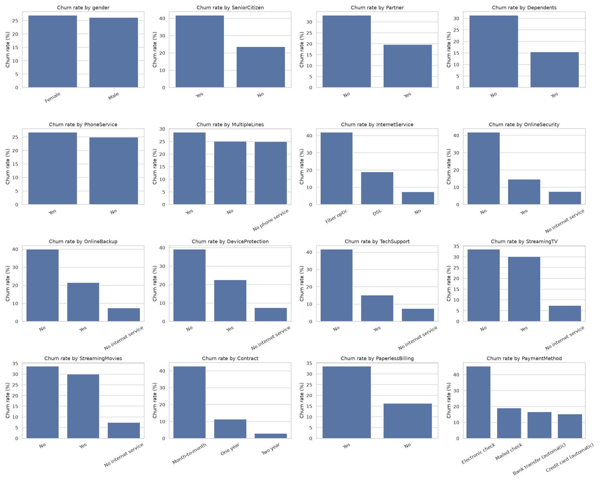
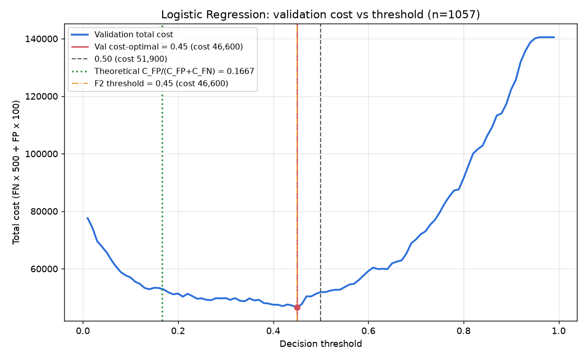

# Customer Churn Prediction – Results & Progress

Telco customer churn prediction with **cost-sensitive decision thresholds** and (upcoming) **SHAP explanations**.
Every human-readable output of the project lives in this folder. Model binaries and prediction files stay in
`../artifacts/` because the scripts read them as inputs.

_Last updated: 2026-10-06_

## Progress

| Stage | Status | Output |
|---|---|---|
| 1. Missing values + EDA | Done | [eda_report.txt](eda_report.txt), `plots/` |
| 2. Feature extraction + scaling | Done | [features_report.txt](features_report.txt) |
| 3. Imbalance-aware models (LogReg, MLP, XGBoost) | Done | [logistic_regression.md](logistic_regression.md), [mlp.md](mlp.md), [xgboost.md](xgboost.md) |
| 4. Cost-sensitive threshold selection | Done (placeholder costs) | [cost_comparison.md](cost_comparison.md), `cost_<model>.md` |
| 5. Real business costs (C_FN, C_FP) | **To do** | rerun stage 4 with real values |
| 6. SHAP analysis | **To do** | – |

## 1. Data and missing values

- **Dataset:** 7,043 customers, 21 columns. The target `Churn` is 26.5% Yes, so the classes are imbalanced. No duplicate rows or customer IDs.
- **Missing values:** only 11 blank `TotalCharges`. All of them have `tenure = 0`, meaning these customers have not been billed yet, so the values are set to **0** rather than imputed.
- **Strongest churn signals:**

  | Signal | Churn rate |
  |---|---:|
  | Month-to-month contract | 42.7% |
  | Electronic check payment | 45.3% |
  | Fiber optic internet | 41.9% |
  | No online security / tech support | ~42% |
  | Senior citizens | 41.7% |

  Low tenure is also a strong signal: churners average 18 months, against 38 for customers who stay.



## 2. Features

- **34 features:** 7 continuous and 27 binary.
- **Engineered features:**
  - AvgMonthlyCharge, ChargeIncrease
  - NumAddonServices, NumServices
  - IsAutoPayment, IsNewCustomer (tenure ≤ 6)
  - LivesAlone, FiberNoSupport
  - LogTotalCharges (replaces the skewed TotalCharges)
- **Cleanup:**
  - "No internet/phone service" is collapsed to "No".
  - Exact-duplicate flags were removed, because duplicates would split SHAP credit.
- **Split:** stratified **70/15/15** train/validation/test (4,929 / 1,057 / 1,057), `random_state=42`.
  - Scalers are fit on train only.
  - Validation is used for every tuning and threshold choice. Test is used only for final evaluation.
- **Three feature versions:**
  - `raw`: unscaled, used by XGBoost.
  - `std`: StandardScaler on the continuous features, used by LogReg and MLP.
  - `norm`: MinMax on all features.

## 3. Models (test set, 280 churners of 1,057)

All three handle the class imbalance through weighting. Without weighting, the baselines reached only about 0.52 recall.

| Model | Imbalance handling | ROC-AUC | PR-AUC | Recall @0.50 | Missed churners @0.50 |
|---|---|---:|---:|---:|---:|
| Logistic Regression | `class_weight="balanced"` | **0.857** | **0.679** | 0.811 | 53 |
| MLP (32→16) | balanced sample weights | 0.854 | 0.656 | 0.818 | 51 |
| XGBoost (depth 3, 113 trees) | `scale_pos_weight=2.77` | 0.855 | 0.667 | **0.829** | **48** |

Accuracy is about 0.75 and is deliberately not optimized. A model that always predicts "no churn" scores 73.5% while catching no churners.

## 4. Cost-sensitive thresholds

**Cost** = missed churners × **C_FN** + unneeded offers × **C_FP**.

The costs are currently **placeholders**:
- C_FN = 500: about 8 months × the average 65 monthly bill.
- C_FP = 100: one retention offer.

Each model's threshold minimizes validation cost and is then evaluated once on test.

| Model | Threshold | Val cost | Test cost | Missed churners | False alarms | Recall |
|---|---:|---:|---:|---:|---:|---:|
| **Logistic Regression** (selected) | 0.45 | **46,600** | 44,600 | 40 | 246 | 0.857 |
| MLP | 0.48 | 46,800 | **42,000** | 40 | 220 | 0.857 |
| XGBoost | 0.44 | 48,700 | 45,000 | 39 | 255 | 0.861 |
| _Contact nobody_ | – | – | 140,000 | 280 | 0 | 0 |
| _Contact everyone_ | – | – | 77,700 | 0 | 777 | 1.0 |

- **Logistic Regression is selected** because it has the lowest validation cost. Its test cost is **68% below doing nothing**.
- **The models are statistically tied.** In a paired bootstrap, every 95% CI for the cost difference between models includes 0.
- **The cost-optimal thresholds sit at about 0.45**, not at the textbook C_FP/(C_FP+C_FN) = 0.17. Class weighting inflates the predicted probabilities, which shifts the best threshold upward.
- **The cost curves are flat between about 0.2 and 0.5**, so the exact threshold matters little. The threshold moves sharply only once a missed churner costs **10× or more** than an offer.



## Files in this folder

| File | Contents |
|---|---|
| `eda_report.txt` | Missing-value handling, summary statistics, churn rate by every category, correlations |
| `features_report.txt` | Feature list, split sizes, scaling checks |
| `logistic_regression.md`, `mlp.md`, `xgboost.md` | Per-model training and evaluation at 0.50 and at the F2-optimized threshold |
| `cost_logistic_regression.md`, `cost_mlp.md`, `cost_xgboost.md` | Per-model cost analysis and cost-ratio sensitivity |
| `cost_comparison.md` | Cross-model comparison, model selection and bootstrap significance |
| `plots/` | EDA charts and validation cost curves |

## How to reproduce

```bash
./run_pipeline.sh                          # full pipeline with placeholder costs
./run_pipeline.sh --c-fn 800 --c-fp 50     # with real business costs
```

The pipeline uses the project virtual environment in `venv/`, with dependencies pinned in `requirements.txt`.

## Next steps

1. Replace C_FN/C_FP with real business numbers and rerun.
2. SHAP analysis:
   - LinearExplainer for the selected Logistic Regression.
   - TreeExplainer for XGBoost, to compare against it.
   - Summary, dependence and per-customer waterfall plots.
