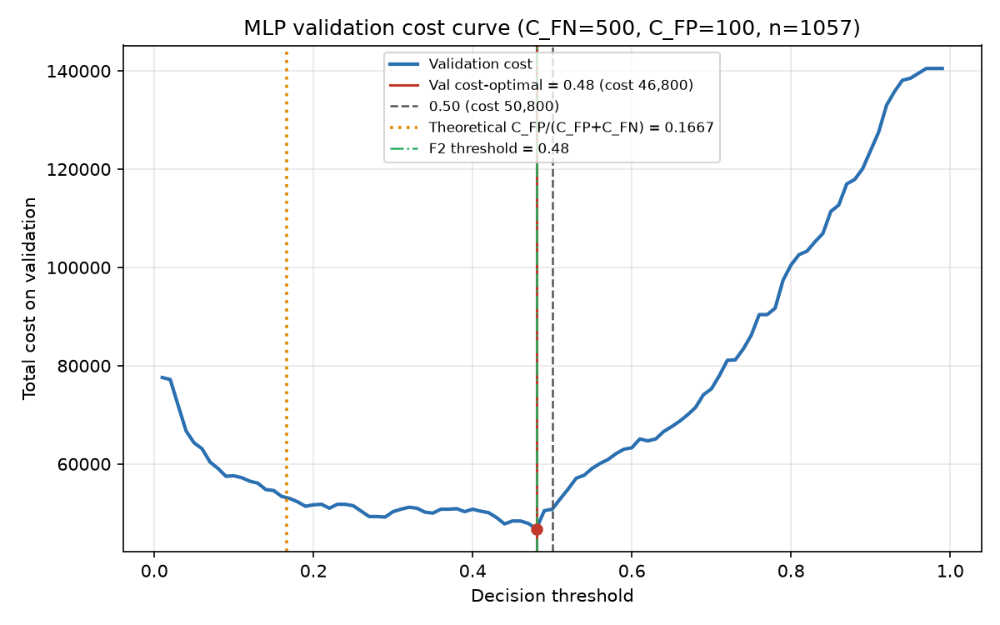

# MLP – Cost-Sensitive Analysis

Generated by `cost_mlp.py` (rerun with `venv/bin/python cost_mlp.py --c-fn 500 --c-fp 100`). No retraining: probabilities are reused from `artifacts/mlp_probs.csv`.

## Cost Assumptions

- Total cost = FN × C_FN + FP × C_FP; TP and TN cost 0. Cost per customer = total / n.
- **C_FN = 500**: revenue lost when a churner is not targeted.
- **C_FP = 100**: cost of a retention offer sent to a customer who would not have churned.
- **These are placeholder values, not business figures.** C_FN ≈ 8 months × ~65 average monthly charge ≈ 500 of lost revenue; C_FP = 100 for a retention offer. Both are configurable via `--c-fn` / `--c-fp`.
- Simplification: a targeted churner is assumed to be retained at no cost beyond what is modelled (TP cost 0, offer always works).

## Method (validation-only selection)

- Model: MLP (32-16, relu, adam), trained with balanced sample weights on the stratified 70/15/15 split (random_state=42, 34 features). Not retrained here.
- Threshold grid 0.01–0.99 (step 0.01). On the **validation** split (n=1057) FN, FP and cost are computed at each threshold; the minimum-cost threshold is chosen (ties → lower threshold).
- Theoretical Bayes-optimal threshold for calibrated probabilities: C_FP / (C_FP + C_FN) = 100 / 600 = **0.1667**. Balanced sample weighting inflates predicted churn probabilities (the model is trained as if classes were 50/50), so its outputs are not calibrated to the 26.5% base rate and the empirical validation-optimal threshold can differ from this value (typically sitting higher).
- Each threshold (0.50, previous F2 = 0.48, validation cost-optimal) is evaluated exactly once on **test** (n=1057). Accuracy is reported but not optimized.

## Validation Cost Curve

- Validation cost-optimal threshold: **0.48**, validation cost **46,800** (44.28 per customer).
- Validation cost at 0.50: 50,800; at the theoretical threshold (nearest grid point 0.17): 53,000.

## Test Results

Test set: n = 1057, positives = 280, negatives = 777. ROC-AUC = **0.8541**, PR-AUC (average precision) = **0.6564**.

| Policy | Thr | TN | FP | FN | TP | Recall | Precision | F1 | F2 | Accuracy | Total cost | Cost/customer | Savings vs nobody |
|---|---:|---:|---:|---:|---:|---:|---:|---:|---:|---:|---:|---:|---:|
| Default 0.50 | 0.50 | 574 | 203 | 51 | 229 | 0.818 | 0.530 | 0.643 | 0.738 | 0.760 | 45,800 | 43.33 | 94,200 (67.3%) |
| Previous F2 | 0.48 | 557 | 220 | 40 | 240 | 0.857 | 0.522 | 0.649 | 0.759 | 0.754 | 42,000 | 39.74 | 98,000 (70.0%) |
| Val cost-optimal | 0.48 | 557 | 220 | 40 | 240 | 0.857 | 0.522 | 0.649 | 0.759 | 0.754 | 42,000 | 39.74 | 98,000 (70.0%) |
| Baseline: target nobody | – | 777 | 0 | 280 | 0 | 0.000 | – | – | – | 0.735 | 140,000 | 132.45 | 0 (0.0%) |
| Baseline: target everyone | – | 0 | 777 | 0 | 280 | 1.000 | 0.265 | – | – | 0.265 | 77,700 | 73.51 | 62,300 (44.5%) |

## Sensitivity to Cost Ratio

C_FP fixed at 100; C_FN varied. For each ratio the threshold is re-selected on validation by minimum cost, then evaluated once on test.

| C_FN | Ratio C_FN/C_FP | Theoretical thr | Val-selected thr | Test FN | Test FP | Test recall | Test cost | Cost/customer | Target-nobody cost | Target-everyone cost |
|---:|---:|---:|---:|---:|---:|---:|---:|---:|---:|---:|
| 100 | 1 | 0.500 | 0.68 | 113 | 94 | 0.596 | 20,700 | 19.58 | 28,000 | 77,700 |
| 200 | 2 | 0.333 | 0.48 | 40 | 220 | 0.857 | 30,000 | 28.38 | 56,000 | 77,700 |
| 300 | 3 | 0.250 | 0.48 | 40 | 220 | 0.857 | 34,000 | 32.17 | 84,000 | 77,700 |
| 500 | 5 | 0.167 | 0.48 | 40 | 220 | 0.857 | 42,000 | 39.74 | 140,000 | 77,700 |
| 1000 | 10 | 0.091 | 0.19 | 9 | 419 | 0.968 | 50,900 | 48.16 | 280,000 | 77,700 |
| 2000 | 20 | 0.048 | 0.04 | 0 | 662 | 1.000 | 66,200 | 62.63 | 560,000 | 77,700 |

## Observations

- At C_FN=500, C_FP=100 the validation-selected threshold is 0.48 (theoretical 0.1667). On test it gives FN=40, FP=220, recall 0.857, precision 0.522, cost 42,000 (39.74/customer).
- Versus the default 0.50 (test cost 45,800), the cost-optimal threshold changes test cost by -3,800.
- The previous F2 threshold (0.48) costs 42,000 on test (+0 vs cost-optimal). F2 weights recall 4× in a harmonic mean, which is not the same as a fixed 5:1 cost ratio, so the two criteria need not agree.
- Every model-based policy beats both baselines: best model test cost 42,000 vs target-nobody 140,000 and target-everyone 77,700.
- The cost-optimal threshold coincides with the previous F2 threshold, so those two rows are identical; at this cost ratio the F2 choice was already cost-optimal on validation.
- The validation minimum is a narrow dip: neighbouring thresholds cost 47,900, 50,500 vs 46,800 at 0.48 (n=1057, so one FN = C_FN). The exact optimum is therefore somewhat noisy; differences of a few FN/FP on test are within sampling noise.
- Sensitivity: as C_FN/C_FP rises from 1 to 20 the validation-selected threshold moves 0.68 → 0.48 → 0.48 → 0.48 → 0.19 → 0.04, trading more FPs for fewer FNs. Compare with the theoretical C_FP/(C_FP+C_FN) column: because balanced weighting inflates probabilities, the validation-selected thresholds generally differ from (mostly sit above) the theoretical ones; with calibrated probabilities they would track them more closely.
- The same threshold (0.48) is selected for ratios 2, 3, 5, so the decision is robust to moderate misestimation of C_FN.
- Cost figures are placeholders; the ranking of thresholds, not the absolute amounts, is the transferable result. Replace C_FN/C_FP with real CLV and offer costs before acting on them.
