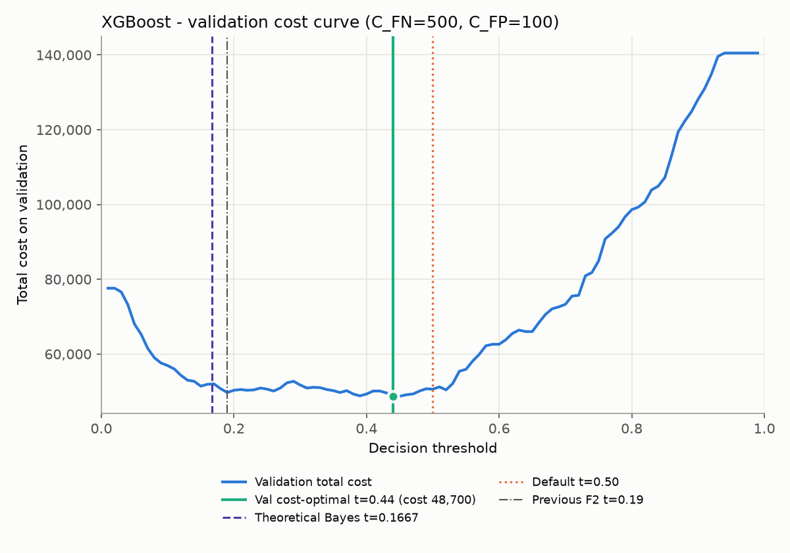

# XGBoost – Cost-Sensitive Analysis

_Generated by `cost_xgboost.py` from `artifacts/xgboost_probs.csv`; rerun the script to reproduce. No model was retrained._

## Cost Assumptions

| Outcome | Cost |
|---|---:|
| False negative (churner not targeted, customer lost) | C_FN = 500 |
| False positive (retention offer to a non-churner) | C_FP = 100 |
| True positive / true negative | 0 |

Total cost = FN x C_FN + FP x C_FP; cost per customer = total / n. Cost ratio C_FN / C_FP = 5.

**These values are placeholders, not business-validated figures.** The default C_FN = 500 approximates lost revenue as ~8 months x ~65 average monthly charge; the default C_FP = 100 is an assumed retention-offer cost. TP is treated as cost 0, i.e. the offer is assumed to always retain a targeted churner and its cost is ignored for true churners. Both values are configurable: `venv/bin/python cost_xgboost.py --c-fn 500 --c-fp 100`.

## Method (validation-only selection)

- Reused the saved predicted probabilities of the trained XGBoost model (scale_pos_weight ≈ 2.77, depth 3, 113 trees); no retraining. Split unchanged: stratified 70/15/15, random_state=42 (validation n=1057, test n=1057).
- Threshold grid 0.01–0.99, step 0.01. On **validation only**, FN, FP and total cost were computed at each threshold; the minimum-cost threshold was selected (ties → lower threshold).
- Theoretical Bayes-optimal threshold for calibrated probabilities: C_FP / (C_FP + C_FN) = 100 / (100 + 500) = **0.1667**. XGBoost was trained with scale_pos_weight ≈ 2.77, which inflates predicted churn probabilities relative to the true base rate, so its scores are not calibrated and the empirical validation-optimal threshold can differ from the theoretical one.
- Previous F2-selected threshold (read from `artifacts/xgboost_metrics.json`, key `threshold`): 0.19.
- Three thresholds (0.50, F2, validation cost-optimal) were each evaluated **once** on test. Accuracy was not used for selection.

## Validation Cost Curve

Validation: 281 churners / 776 non-churners. Target-nobody cost = 140,500.

| Threshold | Val FN | Val FP | Val total cost |
|---|---:|---:|---:|
| 0.17 (≈ theoretical) | 16 | 440 | 52,000 |
| 0.19 (F2) | 16 | 417 | 49,700 |
| 0.44 (val cost-optimal) | 48 | 247 | 48,700 |
| 0.50 (default) | 60 | 206 | 50,600 |

Minimum validation cost: **48,700** at threshold **0.44** (theoretical 0.1667).

## Test Results

Test set: n = 1057 (280 churners, 777 non-churners). ROC-AUC = 0.8546, PR-AUC (average precision) = 0.6665.

| Metric | t = 0.50 | F2 threshold | Val cost-optimal |
|---|---:|---:|---:|
| Threshold | 0.50 | 0.19 | 0.44 |
| TN | 556 | 349 | 522 |
| FP | 221 | 428 | 255 |
| FN | 48 | 9 | 39 |
| TP | 232 | 271 | 241 |
| Recall | 0.8286 | 0.9679 | 0.8607 |
| Precision | 0.5121 | 0.3877 | 0.4859 |
| F1 | 0.6330 | 0.5536 | 0.6211 |
| F2 | 0.7374 | 0.7449 | 0.7457 |
| Accuracy | 0.7455 | 0.5866 | 0.7219 |
| **Total cost** | **46,100** | **47,300** | **45,000** |
| Cost per customer | 43.61 | 44.75 | 42.57 |
| Savings vs target nobody | 93,900 (67.1%) | 92,700 (66.2%) | 95,000 (67.9%) |

Reference baselines on test:

| Baseline | FN | FP | Total cost | Cost per customer |
|---|---:|---:|---:|---:|
| Target nobody (all positives x C_FN) | 280 | 0 | 140,000 | 132.45 |
| Target everyone (all negatives x C_FP) | 0 | 777 | 77,700 | 73.51 |

## Sensitivity to Cost Ratio

C_FP fixed at 100; for each C_FN the threshold is re-selected on validation by minimum cost, then evaluated once on test.

| C_FN | Ratio | Theoretical t | Val-optimal t | Test cost | Cost/customer | Test FN | Test FP | Test recall | Target-nobody cost | Target-everyone cost |
|---:|---:|---:|---:|---:|---:|---:|---:|---:|---:|---:|
| 100 | 1 | 0.500 | 0.72 | 21,100 | 19.96 | 130 | 81 | 0.5357 | 28,000 | 77,700 |
| 200 | 2 | 0.333 | 0.52 | 30,500 | 28.86 | 51 | 203 | 0.8179 | 56,000 | 77,700 |
| 300 | 3 | 0.250 | 0.52 | 35,600 | 33.68 | 51 | 203 | 0.8179 | 84,000 | 77,700 |
| 500 | 5 | 0.167 | 0.44 | 45,000 | 42.57 | 39 | 255 | 0.8607 | 140,000 | 77,700 |
| 1,000 | 10 | 0.091 | 0.15 | 53,300 | 50.43 | 7 | 463 | 0.9750 | 280,000 | 77,700 |
| 2,000 | 20 | 0.048 | 0.08 | 56,000 | 52.98 | 0 | 560 | 1.0000 | 560,000 | 77,700 |

## Observations

- At C_FN = 500 and C_FP = 100, the validation cost-optimal threshold is 0.44. The theoretical Bayes threshold is 0.1667. They differ because scale_pos_weight pushes XGBoost's probabilities upward, so the calibrated-probability rule does not apply directly.
- The validation cost curve is flat near its minimum: 31 of 99 grid thresholds (from 0.18 to 0.52) are within 5% of the minimum cost, and thresholds 0.44, 0.45 tie exactly (lowest kept). The exact optimum is therefore not sharply identified; any threshold in that band gives similar expected cost.
- On test, total cost is 46,100 at 0.50, 47,300 at the F2 threshold (0.19) and 45,000 at the cost-optimal threshold (0.44). The lowest test cost of the three is at the cost-optimal threshold. That comparison uses a single test set of 1,057 customers, so small differences are within sampling noise.
- Every model threshold beats both baselines: target nobody costs 140,000 and target everyone costs 77,700. The cost-optimal threshold saves 95,000 (67.9%) vs target nobody.
- The cost-optimal threshold trades accuracy for cost: accuracy is 0.722 vs 0.746 at 0.50, because missing a churner is 5x as costly as a wasted offer. Accuracy is not the objective here.
- As C_FN/C_FP rises from 1 to 20, the validation-selected threshold moves from 0.72 to 0.08 and test recall moves from 0.536 to 1.000. The threshold choice should therefore follow from the business's real cost estimates; the defaults used here are placeholders.
